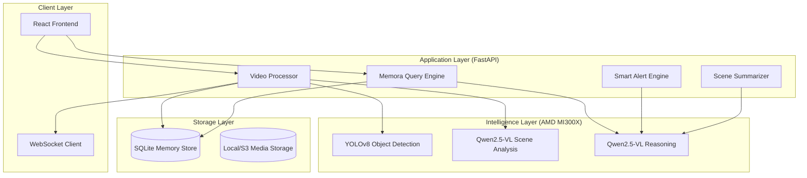

# Memora Vision: Technical Breakdown

**Memora Vision** is an AI-powered visual memory assistant that transforms passive camera feeds into searchable, conversational intelligence. It leverages state-of-the-art multimodal AI models (VLM) accelerated by **AMD Instinct MI300X GPUs** to understand, remember, and narrate visual scenes.

---

## 🏗️ System Architecture

Memora Vision follows a modular, decoupled architecture designed for high-throughput visual analysis and low-latency interaction.

---

## 🧠 Multimodal AI Pipeline

The core "brain" of Memora Vision is a multi-stage pipeline that converts raw pixels into structured semantic memories.

### 1. Structured Object Detection (YOLOv8)
- **Role**: Provides precise spatial metadata.
- **Process**: Identifies 80+ COCO classes (people, bags, laptops, vehicles).
- **Output**: Bounding boxes, class labels, and confidence scores. This metadata acts as "hints" for the more expensive VLM stage.

### 2. Rich Scene Understanding (VLM)
- **Model**: Qwen2.5-VL-7B (Vision Language Model).
- **Process**: Every sampled frame is sent to the VLM along with:
    - The current detected objects.
    - The **previous frame's caption** (to maintain temporal consistency).
    - Spatial context of the location.
- **Narrative Generation**: The VLM generates a descriptive paragraph (e.g., *"A person in a red jacket entered the office and placed a black backpack on the desk near the window."*).

### 3. Activity Tag Extraction
- **Process**: A specialized NLP layer extracts semantic tags (e.g., `entering`, `placing`, `idle`) from the VLM's narrative.
- **Benefit**: Enables fast, indexed filtering of events without full-text search.

---

## 🗄️ Semantic Memory Store

Memora Vision doesn't just log events; it builds a structured history of a space.

### SQLite Schema
- **`events`**: Stores captions, object lists, activity tags, and paths to keyframe thumbnails.
- **`scene_summaries`**: Groups events into 60-second "chapters" and uses the LLM to write a high-level narrative of that time block.
- **`conversations` & `chat_messages`**: Stores multi-turn chat history for the Memora persona.
- **`alert_rules` & `alert_hits`**: Stores monitoring logic and detected incidents.

### Semantic Retrieval
The system uses a weighted search algorithm that matches user queries against:
1.  **Captions**: Full-text narrative matching.
2.  **Object Lists**: Strict keyword matching.
3.  **Activity Tags**: Action-based filtering.

---

## 💬 The "Memora" Conversational Engine

The query engine is designed to act as an **AI Witness**.

- **Persona-Driven RAG**: Uses Retrieval-Augmented Generation (RAG) to inject relevant visual memories into the LLM prompt.
- **Multi-Turn Context**: Tracks conversation state so users can ask follow-ups (e.g., *"Who was that?"* -> *"What was he carrying?"*).
- **Temporal Reasoning**: The LLM analyzes timestamps across multiple events to answer time-based questions (e.g., *"How long was the bag left alone?"*).

---

## 🔔 Intelligent Alert Engine

Memora Vision features a **Two-Tier Alert Evaluation** system:

1.  **Fast Path (Deterministic)**: Keyword-based matching for simple rules (e.g., *"Alert when a dog is seen"*). Low latency, zero cost.
2.  **Smart Path (LLM-Based)**: For semantic conditions like *"Notify me if something unusual happens"*. The LLM evaluates the scene description against the rule's intent to detect anomalies.

---

## 🚀 Real-Time Infrastructure (WebSockets)

To provide a "live" feel, the system uses **WebSockets**:
- As the `VideoProcessor` generates new events, they are instantly broadcast to all connected clients.
- The frontend timeline updates in real-time without browser polling, reducing server load and improving UX.

---

## ⚡ AMD Instinct MI300X Acceleration

The intelligence layer is optimized for **AMD ROCm** and **vLLM**:
- **High Throughput**: MI300X's massive HBM3 memory allows for high-concurrency VLM processing.
- **vLLM Integration**: Uses PagedAttention to optimize KV cache for long-running video analysis sessions.
- **Model Quantization**: Leverages FP16/INT8 precision for maximum inference speed without losing narrative quality.

---

## 🛠️ Tech Stack Summary

- **Backend**: Python 3.12, FastAPI, Uvicorn, SQLAlchemy/SQLite, OpenCV.
- **Frontend**: React 19, TypeScript, Vite, Vanilla CSS.
- **AI/ML**: Ultralytics (YOLOv8), vLLM (Qwen2.5-VL), HuggingFace Transformers.
- **DevOps**: Docker, Render (Backend), Vercel (Frontend), AMD Instinct MI300X (Intelligence).
